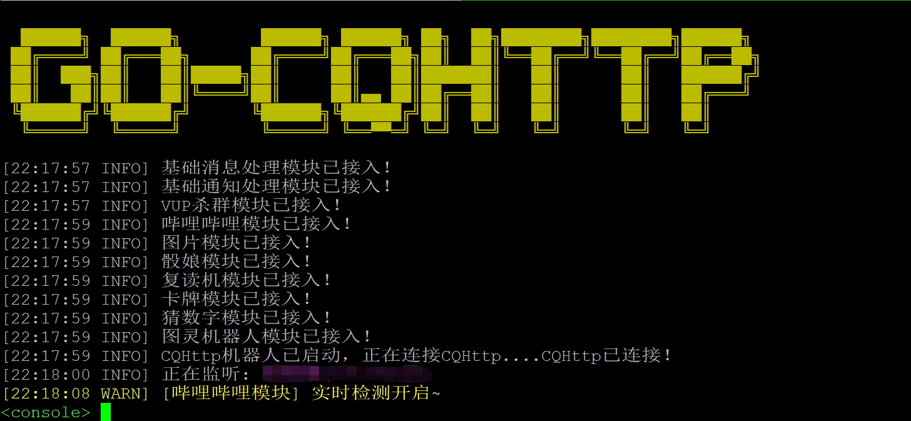
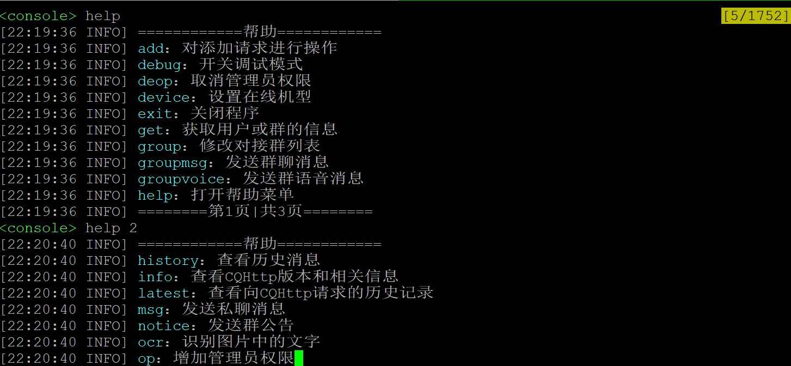
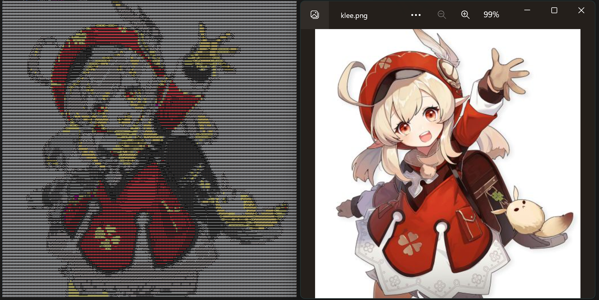
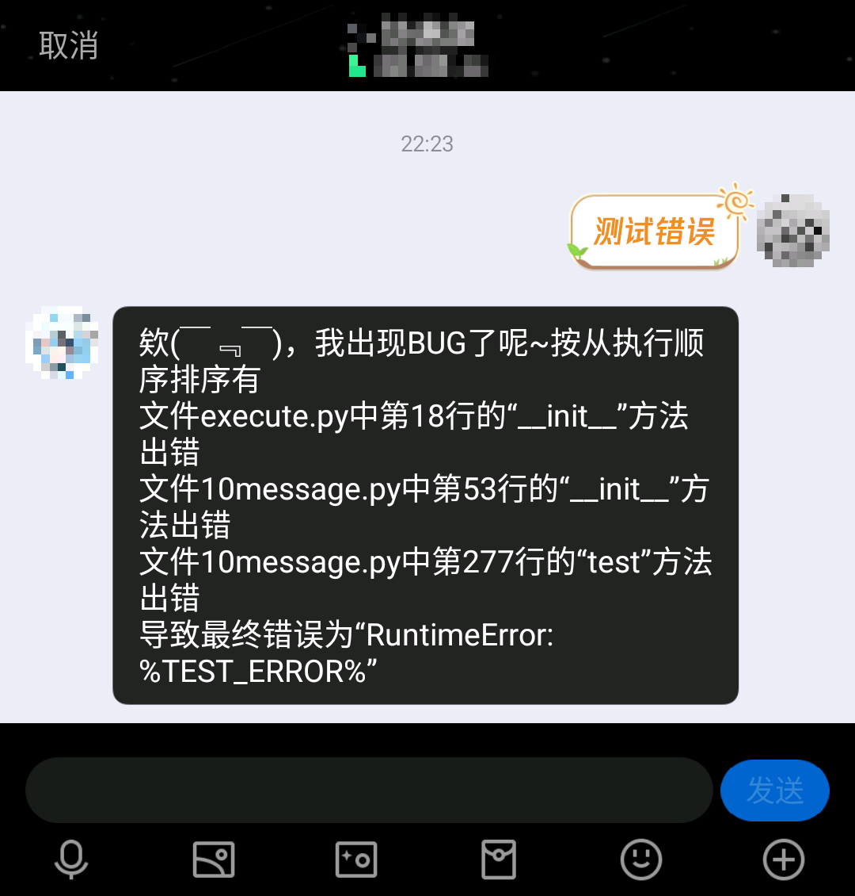
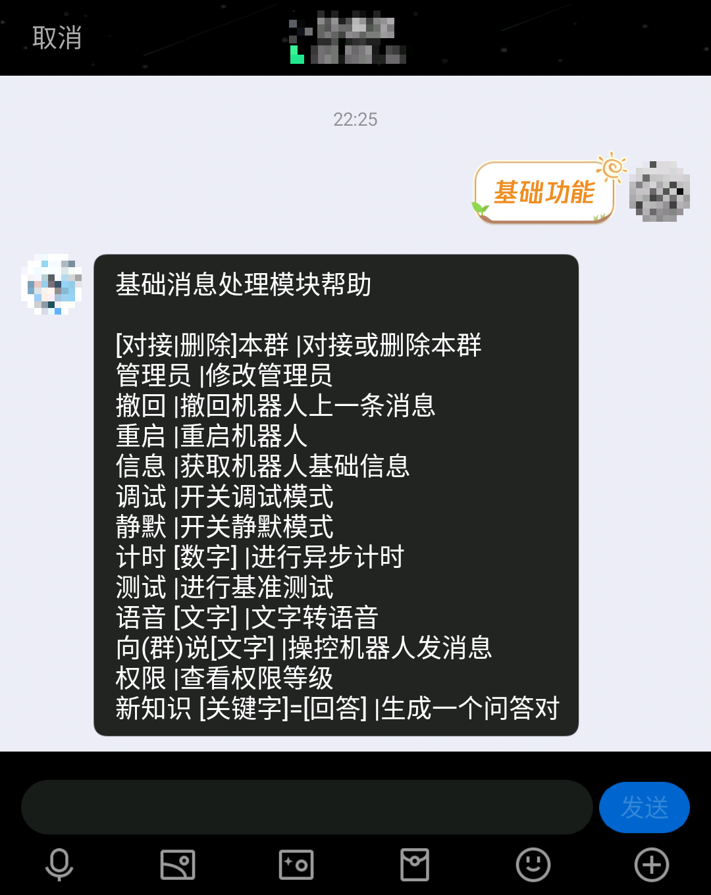
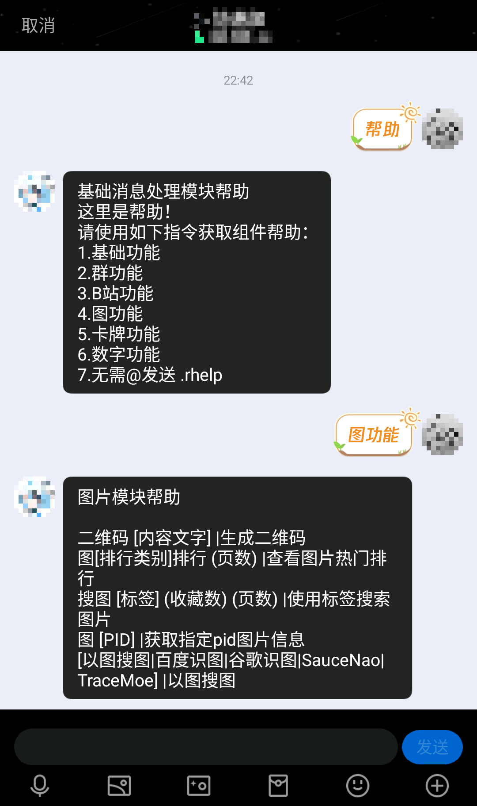
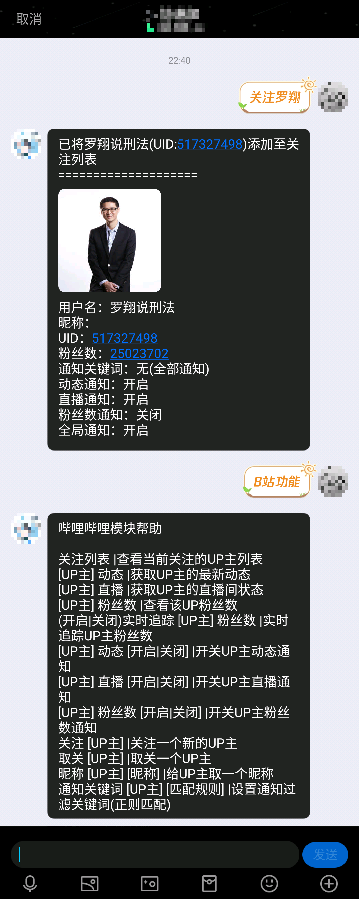
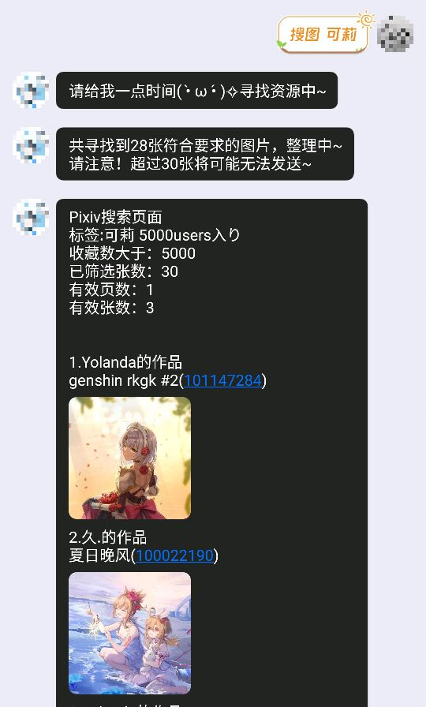

# ConcertoBot

## Description
一个自开发适用于全平台的QQ机器人，用于使用HTTP协议对接符合OneBot协议，并进行自动处理的python程序，主要用于自用，此项目更偏向于个人学习和使用，自带指令系统以及简单的程序接口，适合上手，通讯部分完全可以依照[go-cqhttp HTTP通讯 API](https://docs.go-cqhttp.org/api/#%E5%9F%BA%E7%A1%80%E4%BC%A0%E8%BE%93)进行操作使用和扩展。

## Usage
- Python3.12
- 使用pip install -r requirements.txt安装程序所需第三方库（如需安装其他模块请额外添加缺失库）
- Windows用户请额外执行 pip install windows-curses
- 启动"start.bat"或者"start.sh"

## Tips
- 该项目主要功能请在后台使用help指令查看
- 请在文件夹modules内添加或删除模块，开发参考modules/1notice.py
- 默认对接的API HTTP监听地址为"127.0.0.1:3000"，反向HTTP POST地址为"127.0.0.1:5701"
- 模块错误默认采用utils.py中simplify_traceback()函数处理，便于debug
- 该项目为轻量化使用未采用curses图形库而采用多线程处理后台IO，因此输入命令时收到的新消息可能覆盖命令的显示

## Features
- 模块化的功能加入
- 基础的类终端交互
- 清晰的界面显示和排版
- Threading多线程处理消息
- 方便的调试接口和错误提示
- 不同用户或群的调用权限等级
- 每个群和用户的独立数据存储
- 方便快捷的随机文本选择和回复
- 对图片信息的终端彩色像素画显示
- 支持常用OneBot接口调用

  
  
  
  
  
  
  
  
  

